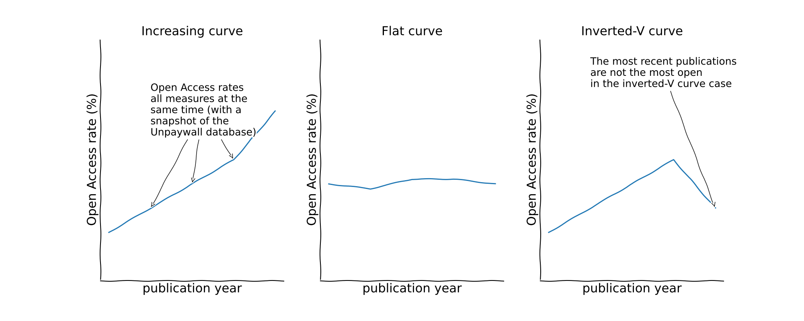
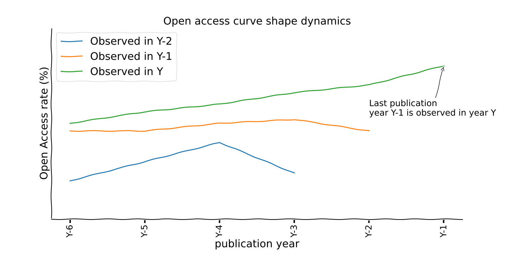
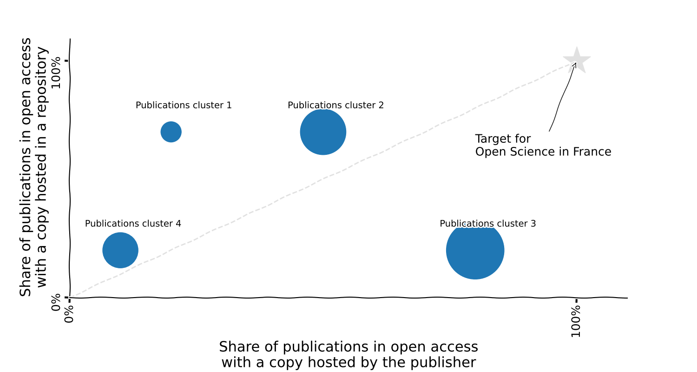

**Keywords**: open science, open access, unpaywall, clinical trials, observational studies, health, scientometrics

# Abstract

# 1. Introduction

# 2. Method

## 2.1 Publications

### 2.1.1 Perimeter definition

#### 2.1.1.1 French Open Science Monitor

 

The French Open Science Monitor is a tool that aims at steering the Open Science policy in France. As such, it produces
statistics that are analyzed over time, and it has to focus on "French" productions. Also, as stated in
[@coso_feedback_2018], we want to use only public or open datasources. Two constraints of perimeter thus appear
naturally : 

 - **only publications with at least an author who has a French affiliation** are considered. The nationality of the 
authors does not come into play. Still, this raises the issue of access to affiliation information. Affiliation metadata
are present in specific sources, like PubMed, but very rarely in the whole Crossref data. To fill in the gaps, we
propose to crawl the affiliation information displayed publicly from the publications webpages. On top of that
identifying a country from an affiliation text is not that straightforward. If you are not convinced, think about a
affiliation stating "Hôtel Dieu de France, Beirut, Lebanon": this does not refer to a French affiliation even thoug
the word "France" is present. We use an automatic detection algorithm, based on Elasticsearch, described i
[@lhote_using_2021], to infer the countries from the affiliations texts.

 - **only the publications with a Crossref DOI** are considered. Duplicates have to be avoided, in order not to coun
twice (or more) a publication and thus add a bias to the statistics tha are produced. It is then key to use a Persisten
IDentifier. Also, we choose to use Unpaywall data for Open Access (OA) discovery. This service produces open data an
offers the possibility to snapshot the whole database, which is an asset to analyse the OA dynamics. For now, Unpaywall
focuses only on Crossref DOI, which leads us to adopt the same perimeter. We are aware this is a bias against some
disciplines, Humanities and Social Sciences for example. 
 

All genres of publications are considered (journal articles, proceedings, books ...) as long as the publication is
associated to a Crossref DOI. Many types appear in the metadata, but for clarity, we group them in categories, namely
journal articles, proceedings, preprints, book chapters, books, the rest being grouped in a category 'Others'. It is
important to note that the 'preprint' type does not appear as such directly in the available metadata (it is generally
declared as journal article). So preprint detection is based on the dissemination platform information. At the time of
writing, only the Cold Spring Harbor Laboratory (BioRxiv, MedRxiv) case is covered, but it can be extended as soon as
another preprint dissemination platform would start using Crossref DOIs.

#### 2.1.1.2 French Open Science Monitor in Health

 

The French Open Science Monitor also introduces a focus on the Health domain. Delimiting a clear perimeter for Health
is not very easy. For now, we simply have chosen to consider **in the scope all PubMed publications, and only these**.
The publications' data used in the French Open Science Monitor in Health is then a subset of the publications descried
above, adding the PubMed presence criterion. Note that "Health" is seen more as a domain than a discipline. In fact,
publications from several disciplines are taken into account in the French Open Science Monitor in Health. A
domain-specific set of disciplines is used in the French Open Science Monitor in Health, as described below.  
 

### 2.1.2 Open access dynamic

From the first edition of the French Open Science Monitor, it was clear that the estimate of the open access rate
should not be static but should try to capture the dynamics of the opening [@jeangirard_monitoring_2019]. Indeed, the
0-day open access exists but we cannot assume it represents the totality of the open access. Therefore, for a given set
of publications, say the publications published during the year Y, it makes sense to measure the open access rate at
different point in time, for example at some moment in year Y+1, Y+2 ...

To do so, it becomes necessary to historicize the database containing the open access information. So, instead of
maintaining a database that keeps track of the opening of each publication, like Unpaywall is doing, we have to make
regular snapshots of the whole Unpaywall database. Each snapshot is used as an observation date to measure the open
access rate. It is important to note that this method natively embeds the potentials open access discovery errors from
the underlying Unpaywall database, that can be false negative (a publication is actually open at this point in time but
it is not detected) or false positive (wrongly seen as open whereas it is closed). 

This method of analysis therefore reveals two temporal dimensions: publication dates and observation dates. Obviously,
the observation date must be after the publication date. To avoid that the proliferation of possible analyses blurs the
message, we propose to look mainly at two elements :

 - A main statistics that is the **1Y Open Access rate**: it represents the open access rate of the publications published during year Y and measured (observed from the snapshot of the OA discovery database) at one point in time during year Y+1 (generally in December if the data is available).

 - Also, the **shape of open access curve** (open access rate function of the publication year). For a given observation date, the open access rate can be estimated broken down by publication year. This then produces a curve of the open access rate, function of the publication year (at a given point in time which is the observation date). Of course this curve can have any shape, and in particular it is not always expected to be monotonic increasing. Indeed, a monotonic increasing curve means that more recent publications are more and more open. That can (hopefully!) happen, but moving barriers and embargoes would genereally brings another type of shape, that would be an inverted-V shape. The next figure illustrates different shapes of Open Access curves. 

{ width=450 }

From an observation date to another, the OA curve shape may change. This evolution of the shape gives an insight of the speed of opening. Indeed, moving from an inverted-V shape, where the most recent papers are not the most open, to an increasing shape would be a proof of the acceleration of the opening. The next figures illustrates the evolution from an inverted-V shape, to flat and then to an increasing OA curve shape. 

{ width=450 }

### 2.1.3 Open access types

As Unpaywall is the Open Access discovery tool we used, we initially based our results on the OA classifications described in [@piwowar_state_2018]. It breaks down the OA types in 5 categories: 'Gold', 'Hybrid', 'Bronze', 'Green', 'Closed'. These categories are also present in the Unpaywall database (and oaDOI API) in the field 'oa_status'.  We first simply grouped the categories 'Gold', 'Hybrid' and 'Bronze' under a 'Publisher hosted' label. However, we now propose another classification that we think more appropriate for the French OA policy steering.

[@piwowar_state_2018] defines 'Green' as 'Toll-access on the publisher page, but there is a free copy in an OA repository'. That implies that a publication that would be free to read on the publisher webpage and that would, at the same time, have a free copy on a repository would not be counted as 'Green'. When we observe the OA rate function of the hosting type, the contribution of the repositories is mechanically reduced in favour of the publishers. This therefore blurs the picture of the real activity of the repositories. That is why we propose to have a first level of analysis, with 3 categories (excluding 'Closed'): 

 - **hosted only on an open repository**: Toll-access on the publisher page, but there is a free copy in an OA repository, corresponging exaclty to the 'Green' definition of [@piwowar_state_2018], that we could rather label 'Green only' 

 - **hosted only by the publisher**: Free to read on the publisher webpage, but no free copy in an OA repository.

 - **hosted on an open repository and by the publisher**: Free to read on the publisher webpage and there is a free copy in an OA repository.

Obviously this does not impact the overall Open Access rate, but this division rebalances the role of the different types of OA hosting. The next figure shows the kind of impact choosing one or the other OA type break down. 

{ width=450 }

Another graphical way to represent this balance is to use a bubble chart. Each bubble represents a cluster of publications (think about having a bubble for each discipline, for each dissemination platform ...), its size depends on the number of publications in the cluster. The x-axis represents the share of OA publications hosted by the publisher: it is then the sum of the share of publication hosted only by the publisher and the share hosted on an open repository and by the publisher. Conversely, the y-axis represents the share of OA publications hosted on a repository: it is then the sum of the share of publication hosted only on a repository and the share hosted on an open repository and by the publisher.

{ width=450 }

The data used to compute these OA types still comes from Unpaywall, but instead of the 'oa_status' field, with use the 'oa_locations' field. For a publication which is open access, it lists all the existing free copies that Unpaywall detected, at the time of the snapshot. Each location is described, in particular with an URL that gives a link to the free copy, and some metadata of the location is associated, in particular the 'host_type', that can take two possibles values, 'publisher' or 'repository'. It is important to note that, for now, preprint servers are considered repositories.

\newpage

### 2.1.4 Discipline and language impact

All disciplines and publication languages are covered. Again, however, no metadata exists for describing the discipline
or the publication language. To enrich the metadata, we then rely on machine learning approches, that try to infer
discipline and language from the available metadata. 

For the language detection, only the title, and the abstract are used if available, with the lid.176.bin fasttext word
embedding machine learning algorithm [@joulin_bag_2016].

Discipline detection also uses journal and keywords metadata if available. A general classifier is implemented for all
domains, it classifies the publications into 10 macro disciplines: Mathematics, Chemistry, Physics & astronomy,
Fondamental biology, Medical research, Computer sciences, Earth science ecology energy & applied biology, Humanities,
Social sciences, Engineering. It is trained on data from the Pascal & Francis database and uses a Fasttext classifier.
More details are discussed in the previous paper [@jeangirard_monitoring_2019]. 

A domain-specific classifier is implemented for the Health domain. It classifies the publications into 17 disciplines,
built from the Fields of Research taxonomy. The full methodology is detailed in [@jeangirard_content-based_2021].

The main purpose of these metadata enrichments is to be able to analyse the open access rate in function of languages
and disciplines. We expect to observe differences not only in the global OA rate (which discipline is the most open ?),
but also in the dynamics trends (which discipline show the strongest increase over time ?) or in the opening uses
(relying on publisher hosted open access versus open repositories).

### 2.1.5 Publishers and dissemination platforms strategies

#### 2.1.5.1 Identification of the dissemination platforms

#### 2.1.5.2 Business models

Diamond DOAJ, Gold, Hybrid

#### 2.1.5.3 Licences

licence info from unpaywall
normalized into cc-by ...

#### 2.1.5.3 Article Processing Charges (APC) estimation

estimation from openAPC and DOAJ for hybrid and gold (by definition 0 for diamond).

### 2.1.6 The role of the open repositories

normalization of the oa_locations data from unpaywall. Beware, mixes with preprint servers.

### 2.1.7 Other impacts on open access

#### 2.1.7.1 Funding

PubMed gives info on grant declaration. When this info is available, can we observe an impact on measured OA ? 

#### 2.1.7.2 Main authors affiliation country

Info from PubMed (only health domain).
Main authors : first and last
Correlation between OA rate and affiliation country of main authors ?
-> link to funding and OA mandates

## 2.2 Clinical trials and observational studies

### 2.2.1 Perimeter

clinicaltrials.org and EUCTR 
reconciliation based on id
one of the location in France

### 2.2.1 Main opening indicators

Results and publication declaration
Time to register the study
Time to register the results

### 2.2.2 Lead sponsor impact 

## 2.3 Data collection system and architecture

In this section, we will try to present the global workflow to collect, enrich and consolidate the data as described
before with the technical and the storage challenges.

### 2.3.1 Data manipulation

Collect, Select, Enrich and Save
As describe before, we collect data from multiple sources (PubMed via Medline, Crossref, our own list of DOIS), we then 
try to guess the country according to the affiliations. And from the DOIs, we collect more details about that 
publication via Unpaywall. By details, we mean open access, 
Each step is really time and CPU consuming. Assuming any step can fail at any time, we choose to develop each step as
independent and idempotent.

From Pubmed, collect all the database via Medline and store it as JSONL files on Object Storage on OVH Cloud in a
dedicated container.
At that point, we have all the notices of medical publications. We there find the affiliations of each publication.
With the affiliation we tried to detect the countries of the institutions mentioned in the affiliations, in order to
filter on French publications. The selected publications are stored as JSONL files in another dedicated container on 
Object Storage on OVH Cloud.
Now focusing on the French publications, we use the extracted notices to match them against a MongoDatabase that we
built on a dump of Unpaywall. We use th DOI to consolidate the data and then add many detail

### 2.3.2 Data storage

To do so, we needed to precisely define the input and the output of each step, and how to store the intermediate
results. As JSON is the most common format to manipulate data, we choose to store the results into JSONL files and to
save them into a dedicated container on the ObjectStorage of OVH Cloud. ObjectStorage is a data storage architecture
that is easily queryable.
MongoDB
Elastisearch

### 2.3.2. Microservices

synchronous / asynchronous, Docker
All the tasks before are developed in Python and running as microservices in a Docker images. We used Flask as a Web
Framework. It enables us to launch the steps by calling the endpoint urls with the specified arguments. This way we
were still the bandmaster of the wall workflow and where still able to follow the progress of all these asynchronous
tasks.

### 2.3.3. Cloud

OVH Cloud, remote, scalability, kubernetes
As a limitation, we chose to collect all the publications from 2013 to today. Only from Crossref, it's about 45 million
publications. Let's call that "big". And the time to collect all these data could be quite long. So we had to 

# 3. Results

# 4. Discussion and conclusion

## 4.1 Findings

## 4.2 Limitations and future research

# Software and code availability
https://github.com/dataesr/bso-publications
https://github.com/dataesr/bso-clinical-trials

# Data availability
portail MESRI

# Acknowledgements

WeDoData
Florian Naudet (https://orcid.org/0000-0003-3760-3801) University of Rennes 1, Rennes, France

# References
